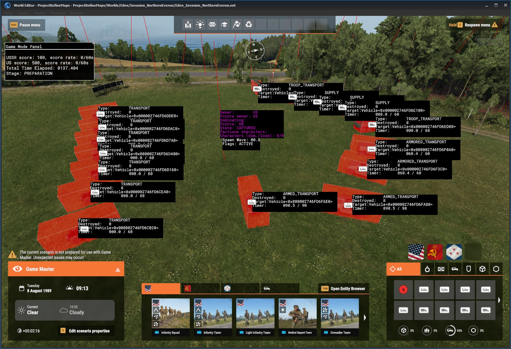
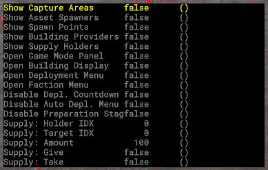

# Diag Menu
This page explains how to use the diag menu (cheat menu) for testing Escalation in World Editor.

Diag Menu can help you test various systems of Escalation.

# Diag Menu Location
When in Play Mode in World Editor, hold `LWin+LAlt`, use arrow keys to navigate to `Project Refine` category.

# Diag Menu Options

`Show Capture Areas` - Shows state of all capture areas

`Show Asset Spawners` - Shows state of all asset spawners

`Show Spawn Points` - Shows state of all player spawn points which are shown in deployment menu

`Show Building Providers` - Shows state of all building providers. They enable building through building UI.

`Show Supply Holders` - Shows state of all supply holders

`Show Deployment Menu` - Opens Deployment Menu

`Show Faction Menu` - Opens Faction Selection Menu

`Disable Depl. Countdown` - Disables spawn wave countdown in Deployment Menu

`Disable Auto Depl. Menu` - Disables automatic opening of Faction Selection Menu and Deployment Menu

`Disable Preparation Stage` - Disables preparation stage at the start of the game mode, game mode will switch to Live stage instantly
