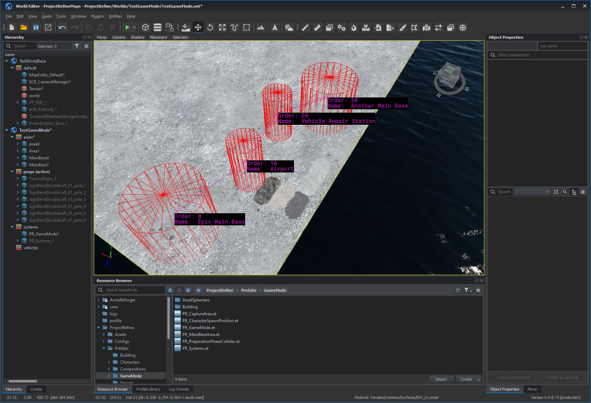
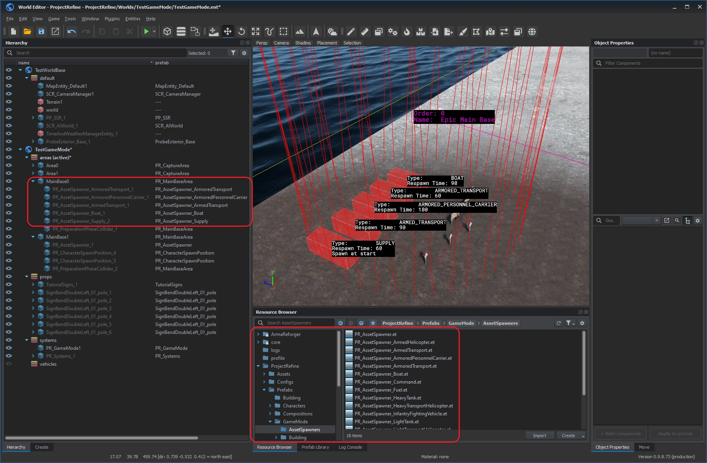
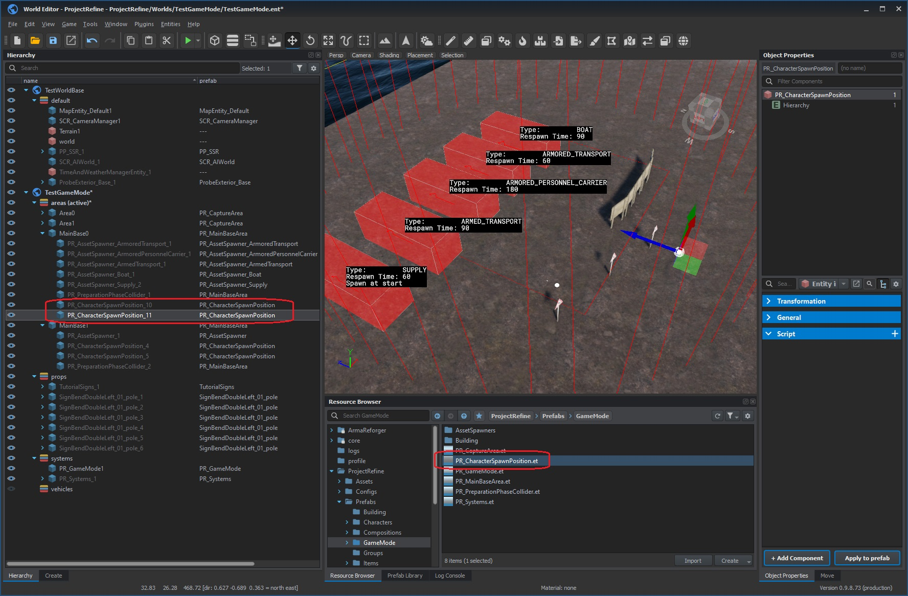
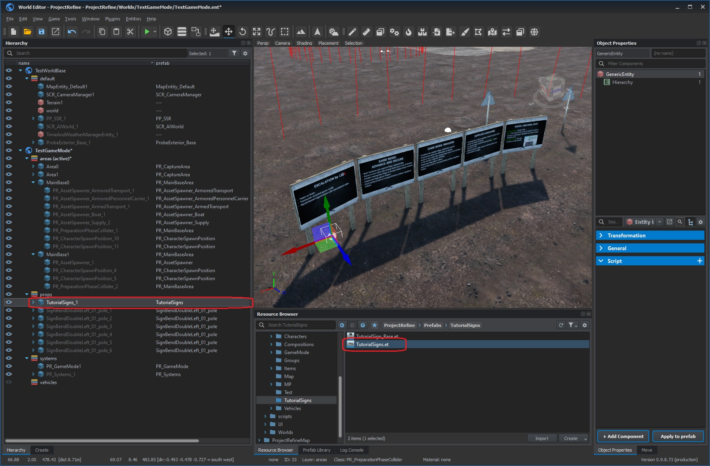

# Game Mode Configuration
This page explains how to configure Escalation maps and factions.

# Mission Headers and Worlds
Configuration of maps is achieved by both world and mission header which launches that world.

World specifies only main bases, capture points, vehicle and character spawn positions.

Mission header specifies which factions will be used, type of game mode (Invasion or Advance and Secure), and faction randomization.

Therefore same world can be reused with different factions or game mode types, and also you can override those values through server configuration file.

# Mission Header Configuration
Those values are relevant for game mode configuration:

`m_sRefineFaction_0`, `m_sRefineFaction_1` - these values specify keys of factions which will be used. (example: `US`, `USSR`, etc). Note that those factions must be specially configured (modded) to contain Escalation-specific data for Escalation to work properly. You can't simply use any faction until it has those values!

`m_eRefineGameModeArchetype` - specifies the game mode type (Invasion or Advance and Secure)

`m_bRefineRandomizeFactions` - when true, selected factions will be swapped with 50% chance.

# Faction Configuration
If you want to use own faction in Escalation, it must satisfy following criteria:
- It must be present in following faction manager prefab with a unique faction key: `{4A188E44289B9A50}Prefabs/MP/Managers/Factions/FactionManager_Editor.et`. This prefab is from base Reforger game, not from Escalation mod.
- It must have following data configured:
  - `PR_AssetList` - specifies list of vehicles for Asset Spanwers
  - `PR_RoleList` - specifies list of player roles
  - `PR_BuildingList` - specifies list of assets for Building Mode

Full description of PR_AssetList, PR_RoleList, PR_BuildingList will be done later, for now refere to existing factions
## PR_AssetList
TBD
## PR_RoleList
TBD
## PR_BuildingList
TBD

# World Configuration

## Create a SubScene
Create a subscene from any world. The base world must not have Game Mode in it since we will add our own. Also base world must not be a Game Master world such as GM_Arland.

## Add Essential Prefabs
Place following prefabs:

`PR_GameMode.et` - prefab with Escalation game mode

`PR_Systems.et` - prefab with various game systems like garbage manager, chat, etc

`SCR_AIWorld....et` - prefab which is only required if you plan to spawn and use AI. Note that every world is likely to have its own prefab, for instance `SCR_AIWorld_Arland.et`, `SCR_AIWorld_Eden.et`.

## Provide Mission Header for testing
To preview your world in World Editor you will also need to have values from Mission Header, such as keys of used factions or game mode type.

You can provide a test mission header through `Test Mission Header` property of `PR_GameMode` prefab. You can drag and drop config file `PR_MissionHeaderTest.conf` into the property, or create your own.

Values in that misison header are only valid when previewing the world in World Editor.

## Add Main Bases and Capture Areas
Use the following prefabs:

`PR_MainBaseArea.et` - for Main Bases

`PR_CaptureArea.et` - for intermediate Capture Areas

Place main bases and capture areas anywhere you like.

Find `PR_CaptureArea` component on every main base and capture area, specify following properties:

`Order` - specifies linkage order. In Invasion mode the invaders' Main Base is first and the defenders' main base is last. In AAS it doesn't matter which base is first or last.

`Radius` - size of capture area

`Name` - the name shown in UI and on the map

Now you should have Main Bases and Capture Areas properly linked with arrows in World Editor according to the order you have specified.

## Add Asset Spawners
Asset Spawners must be added to Main Bases as **child entities**.

Use `PR_AssetSpawner_XXX.et` prefabs. Don't place plain PR_AssetSpawner entities, at least create own prefabs inherited from `PR_AssetSpawner.et`.

## Add Infantry Spawn Points
Character spawn points must be added to Main Bases as **child entities**.

Use `PR_CharacterSpawnPosition.et` prefab. You should add multiple spawn points to each main base, they will be selected randomly.

## Add Tutorial Signs
Tutorial signs have the official in-game documentation for Escalation.

Use `TutorialSigns.et` prefab.

Appearence and content will change later, but please place them somewhere at main bases for future compatibility.

You can place them anywhere, they don't have to be within main base hierarchy.

